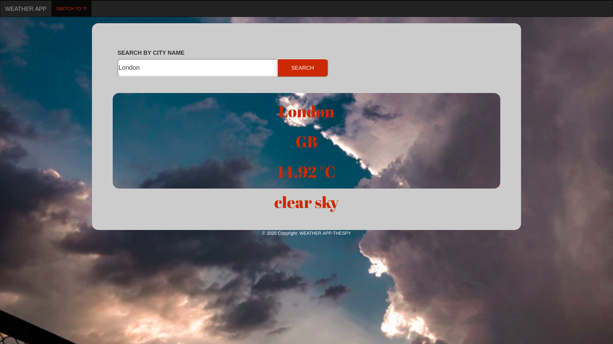

# WEATHER APP

## [LiveDemo](https://abdoulaye-thespy.github.io/Weather-App/#)

## Project description

- As this project is still under reviews the design is not quite it yet.

- This is a Weather App Built using javascript and Webpack to bundle multiple files of javascript.
- 
## Screenshots

# Main page

## Built with

- HTML5
- CSS3
- JS ES6
- Webpack bundler
- Boostrap

## Getting Started

- Clone the git repository.
- cd into the project
- run npx webpack to built the main.js file
- Hit if you run npx webpack --watch, you won't need to run npx webpack each time you make changes on one of the JS files.
- Open index.html using your prefered browser

## Author

Abdoulaye Njigouh

- Github: [@Abdoulaye](https://github.com/Abdoulaye-Thespy)

## Show your support

Give a ⭐️ if you like this project!